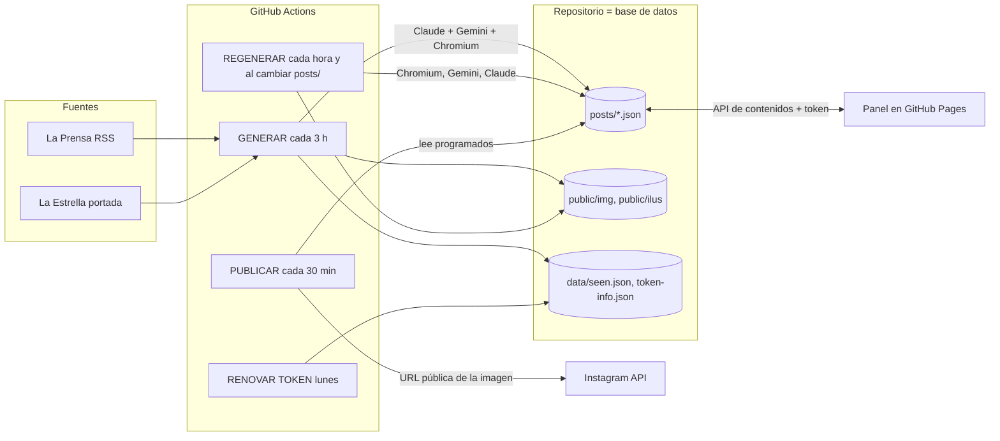
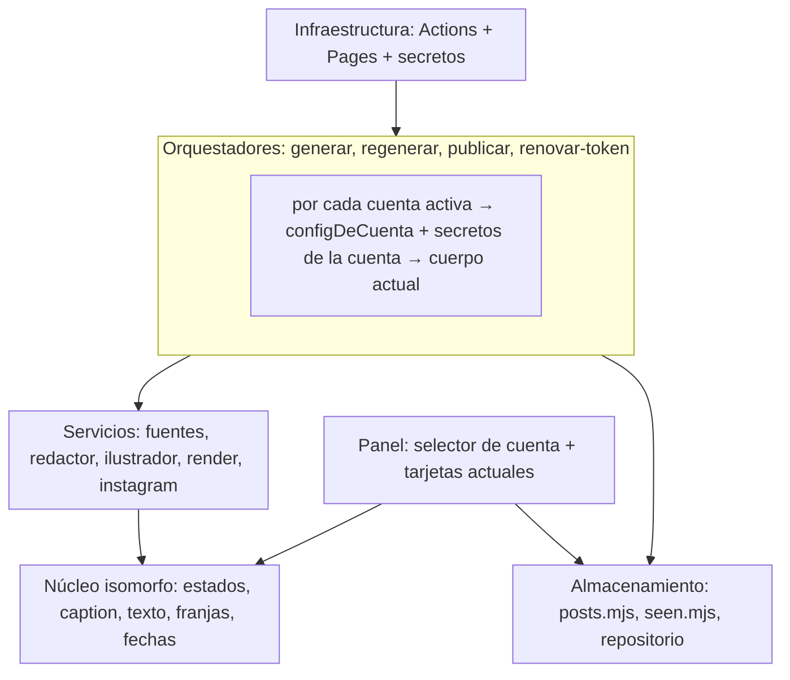

# Arquitectura de Sin Línea

Estado documentado: 2026-09-08, commit `835fc97` de `main`.
Propósito: describir cómo funciona hoy el sistema (una sola cuenta), qué se
reutiliza tal cual, y cómo evoluciona hacia un panel multi-cuenta para medios
digitales sin reescribir lo que ya funciona. El plan por etapas está en
[ROADMAP.md](ROADMAP.md).

## 1. Qué es hoy

Un sistema semiautomático que lee noticias de Panamá, redacta posts con Claude,
genera una ilustración con Gemini, dibuja una imagen 1080×1350 y la publica en
Instagram tras la aprobación de una persona desde un panel web. Todo corre en
GitHub: Actions como cron, el repositorio como base de datos y GitHub Pages
como hosting del panel y de las imágenes. Costo de infraestructura: 0.

Cifras del código: 21 módulos en `src/` (≈1.900 líneas), panel de 3 archivos
(≈500 líneas), 1 plantilla HTML, 27 archivos de pruebas (157 unitarias, 12 de
render en Chromium, 6 de panel de extremo a extremo).

## 2. Flujos y componentes



### 2.1 GENERAR (`src/generar.mjs`)
1. Lee `config.json` y los posts existentes; calcula el cupo diario restante.
2. Recolecta candidatos (`lib/fuentes.mjs` → `rss.mjs`, `portada.mjs`,
   `articulo.mjs`), filtrando URLs ya vistas (`lib/seen.mjs`) y ya usadas.
3. Claude (`lib/redactor.mjs`, salida estructurada con Zod) elige hasta
   `maxPorCorrida` noticias y redacta titular, bajada, caption, hashtags y
   escena de la ilustración, con la línea editorial de `prompts/editorial.md`.
4. Por cada post: ilustración con Gemini (`lib/ilustrador.mjs`), render con
   Chromium + sharp (`lib/render.mjs` + `templates/post.html`) con acortado
   automático del texto si no cabe (`lib/texto.mjs`), y escritura de
   `posts/<id>.json` en estado `borrador`.
5. Marca las URLs como vistas, archiva posts antiguos y hace commit + push.

### 2.2 REGENERAR (`src/regenerar.mjs`)
Corrige lo que quedó desfasado: redacta escenas vacías (Claude), genera
ilustraciones pendientes (Gemini, máximo `maxPorCorrida` por corrida), y vuelve
a dibujar los posts cuyo `imagen.hash` no coincide con el texto actual, cuya
plantilla cambió de versión o cuyo render falló. Se dispara cada hora y en cada
push que toque `posts/` (es decir, tras cada edición desde el panel).

### 2.3 Panel (`panel/`)
Página estática sin framework. Lista los posts por estado (borrador,
programado, publicado, descartado), permite editar textos, escena e
ilustración, aprobar con una franja horaria, descartar, reintentar. Escribe
directamente en el repositorio con la API de contenidos de GitHub usando un
token de acceso fino guardado en `localStorage` (`panel/almacen.mjs`), con
bloqueo optimista por `sha` y un reintento en caso de conflicto. En local usa
`src/serve.mjs` (`/api/posts`). Comparte lógica con el servidor a través de
módulos isomorfos copiados a `dist/panel/lib/` por `src/build.mjs`.

### 2.4 PUBLICAR (`src/publicar.mjs`)
Cada 30 minutos toma los posts `programado` cuya hora ya pasó y los publica con
`lib/instagram.mjs` (contenedor → sondeo → publicación → permalink), usando la
URL pública de la imagen en GitHub Pages. Avisa cuando el token está por vencer.

### 2.5 Módulos

| Módulo | Responsabilidad | Isomorfo | Depende de |
|---|---|---|---|
| `lib/config.mjs` | Carga y valida `config.json` | no | `secretos.mjs` |
| `lib/secretos.mjs` | Nombres de secretos por cuenta, lectura desde el entorno, filtro de valores | no | — |
| `lib/rss.mjs`, `portada.mjs`, `articulo.mjs`, `fuentes.mjs` | Descarga y normaliza candidatos por fuente | no | `util.mjs` |
| `lib/seen.mjs` | URLs ya consideradas (`data/seen.json`) | no | — |
| `lib/redactor.mjs` | Prompts y llamadas a Claude: selección/redacción, acortado de textos, escena | no | SDK Anthropic, `texto.mjs`, `estados.mjs` |
| `lib/caption.mjs` | Composición y límites del caption | **sí** | — |
| `lib/texto.mjs` | Límites titular/bajada, render con ajuste | **sí** | — |
| `lib/estados.mjs` | Estados, transiciones, hashes, `necesitaIlustracion`, `necesitaEscena` | **sí** | — |
| `lib/franjas.mjs`, `fechas.mjs` | Horarios y fechas en zona de Panamá | **sí** | — |
| `lib/posts.mjs` | Validación, ids, rutas, lectura/escritura, archivo | no | `estados.mjs` |
| `lib/ilustrador.mjs` | Cliente de Gemini (imágenes) y guardado JPEG | no | sharp |
| `lib/render.mjs` | Datos de plantilla, HTML, captura con Chromium | no | Playwright, sharp |
| `lib/instagram.mjs` | Cliente de la Instagram API (Instagram Login) | no | — |
| `generar/regenerar/publicar/renovar-token.mjs` | Orquestadores con dependencias inyectables | no | todo lo anterior |
| `build.mjs`, `serve.mjs` | Construcción de `dist/` y servidor local | no | — |
| `panel/app.js`, `almacen.mjs` | Interfaz y almacenes (local / GitHub) | navegador | módulos isomorfos |

Los módulos isomorfos no importan nada de Node y son la única lógica compartida
entre servidor y navegador.

### 2.6 Modelo de datos

Un archivo JSON por post en `posts/`:

```
id, estado (borrador | programado | publicado | descartado | error),
fuente { medio, url, titulo, fecha }, categoria, variante (negro | amarillo | rojo),
titular, bajada, caption, hashtags[], creado, actualizado, programado,
imagen { ruta, url, hash, version, renderizada } | null,
ilustracion { descripcion, usar, ruta, hashDescripcion, proveedor, modelo, generada, error } | null,
publicacion { idMedia, permalink, fecha } | null, error { paso, mensaje, fecha } | null
```

`imagen.hash` resume el texto visible, la variante, la ilustración usada y la
versión de la plantilla: si algo cambia, REGENERAR vuelve a dibujar. La
plantilla declara `data-version`; subirla re-dibuja todos los posts activos una
vez. Los posts publicados o descartados se mueven a `posts/archivo/<mes>/`
tras `archivarDespuesDeDias`.

### 2.7 Configuración y secretos

- `config.json`: marca (nombre, usuario, lema), zona horaria, `pages.baseUrl`,
  fuentes, cupos de generación, modelo y esfuerzo de Claude, franjas,
  versión de la API de Instagram, ilustraciones (proveedor, modelo, estilo,
  rótulo, tope por corrida), días de archivo.
- `prompts/editorial.md`: línea editorial (system prompt).
- `templates/post.html` y `assets/logo.png`, `assets/fonts/`.
- Secretos del repositorio: `ANTHROPIC_API_KEY`, `GEMINI_API_KEY`,
  `IG_ACCESS_TOKEN`, `IG_USER_ID` (y `GH_PAT`, pendiente, para renovar el
  token de Instagram). El token del panel vive solo en el navegador.
- `lib/secretos.mjs` (M0): convención de nombres por cuenta
  (`IG_ACCESS_TOKEN_<ID>`), lectura de secretos por nombre desde el entorno,
  lista de secretos requeridos y filtro `ocultarSecretos` que tapa tokens y
  claves en todo mensaje que se registra o se guarda. `src/verificar.mjs`
  (`npm run verificar` y el workflow manual "Verificar configuración y
  secretos") informa qué falta sin mostrar valores.

### 2.8 Convenciones
Node 20+ ESM en español; dependencias inyectables en todos los orquestadores
(`fetchText`, `client`, `render`, `ilustrador`, `guardar`, `acortar`,
`redactarEscena`, `ig`); `node:test`; commits del bot con `[skip ci]` salvo el
último; grupo de concurrencia `sinlinea` para que las corridas no se pisen;
todo dato del panel se pinta con `textContent` (sin HTML inyectado).

## 3. Supuestos de "una sola cuenta" (lo que hay que desacoplar)

| Supuesto | Dónde vive |
|---|---|
| Una marca (nombre, usuario, lema, logo, colores) | `config.json → marca`, `assets/logo.png`, variables CSS de la plantilla |
| Una línea editorial | `prompts/editorial.md` |
| Un conjunto de fuentes, franjas, cupos y estilo de ilustración | `config.json` |
| Un token y un usuario de Instagram | secretos `IG_ACCESS_TOKEN`, `IG_USER_ID`; `publicar.mjs`, `renovar-token.mjs` |
| Una memoria de URLs vistas y una fecha de vencimiento del token | `data/seen.json`, `data/token-info.json` |
| Posts, imágenes e ilustraciones en carpetas planas | `posts/`, `public/img/`, `public/ilus/`; `posts.mjs` (`rutaImagen`, `rutaIlustracion`, `leerPosts`, `archivar`) |
| Ids sin cuenta (`fecha-hora-medio-hash`) | `posts.mjs → nuevoId` |
| El panel no sabe de cuentas: lista todo, usa las franjas y la marca globales | `panel/app.js`, `panel/config.json` (generado por `build.mjs` y `serve.mjs`) |
| Un mismo grupo de concurrencia y un mismo `git add` de rutas | `.github/workflows/*.yml` |

Ninguno de estos supuestos está enredado con la lógica de negocio: los módulos
reciben `config`, rutas y clientes por parámetro. Eso es lo que hace viable
una migración gradual.

## 4. Qué se reutiliza tal cual

Sin cambios de código (solo reciben otra configuración o ruta):
`rss.mjs`, `portada.mjs`, `articulo.mjs`, `fuentes.mjs`, `redactor.mjs`,
`caption.mjs`, `texto.mjs`, `estados.mjs`, `franjas.mjs`, `fechas.mjs`,
`ilustrador.mjs`, `instagram.mjs`, `render.mjs` (ya recibe `logoUrl` y los
textos de marca como datos), `seen.mjs` (recibe la ruta), `util.mjs`,
`templates/post.html` (los colores y el logo entran como datos/variables),
`panel/almacen.mjs`, los workflows en su forma actual, y las 27 suites de
pruebas.

Con adaptación pequeña y localizada:
`config.mjs` (cargar varias cuentas y producir la "configuración efectiva"),
`posts.mjs` (campo `cuenta`, id con cuenta, rutas por cuenta para `data/`),
los cuatro orquestadores (un bucle por cuenta alrededor del cuerpo actual),
`build.mjs` y `serve.mjs` (exponer la lista de cuentas al panel),
`panel/app.js` (selector y filtro por cuenta).

Nada se reescribe: el cuerpo de cada flujo queda idéntico y se ejecuta una vez
por cuenta.

## 5. Arquitectura objetivo

### 5.1 Concepto central: la cuenta

Una **cuenta** es una marca en Instagram con su propia configuración editorial.
Vive en `cuentas/<id>/`:

```
cuentas/
  sinlinea/
    config.json      marca, fuentes, franjas, cupos, ilustraciones.estilo/rotulo,
                     instagram { usuarioIdSecreto, tokenSecreto }, zonaHoraria (opcional)
    editorial.md     línea editorial (hoy prompts/editorial.md)
    logo.png         logo (hoy assets/logo.png)
  otro-medio/
    ...
```

`config.json` en la raíz conserva lo **global**: `pages.baseUrl`, `claude`,
`instagram.apiVersion`, `ilustraciones` (proveedor, modelo, tamaño, tiempo de
espera, tope por corrida), `archivarDespuesDeDias`, zona horaria por defecto y
la lista de ids de cuentas activas.

`configDeCuenta(global, cuenta)` devuelve un objeto con **la misma forma que el
`config.json` de hoy**. Así todos los módulos siguen recibiendo exactamente lo
que reciben ahora, sin conocer la existencia de otras cuentas.

### 5.2 Capas



- **Núcleo isomorfo**: sin cambios. Es la garantía de que panel y servidor
  calculan lo mismo (hashes, estados, límites).
- **Servicios**: sin cambios; reciben la configuración efectiva de la cuenta.
- **Orquestadores**: el único cambio estructural es el bucle por cuenta y la
  resolución de secretos por cuenta. Los cupos (`maxBorradoresPorDia`,
  `maxPorCorrida`) se aplican por cuenta.
- **Almacenamiento**: cada post lleva `cuenta`; `data/<cuenta>/` guarda la
  memoria de URLs y la información del token; las imágenes siguen en carpetas
  planas porque el id ya las hace únicas.
- **Panel**: un selector de cuenta arriba (chips), filtro de tarjetas por
  `cuenta`, franjas y marca de la cuenta seleccionada al aprobar. El almacén
  no cambia (sigue escribiendo `posts/<id>.json`).
- **Infraestructura**: mismos workflows. Los secretos por cuenta se nombran en
  la configuración de la cuenta (`tokenSecreto: "IG_ACCESS_TOKEN_OTROMEDIO"`)
  y el workflow los expone como variables de entorno; la cuenta `sinlinea`
  apunta a los nombres actuales, así que no hay que tocar secretos existentes.

### 5.3 Reglas de diseño para la migración
1. La cuenta por defecto (`sinlinea`) debe comportarse igual que hoy: mismas
   corridas, mismos secretos, mismas rutas de imágenes.
2. Los posts existentes no se reescriben: `leerPosts` completa `cuenta:
   "sinlinea"` en memoria cuando falta. Solo los posts nuevos llevan el campo.
3. Cada cambio se prueba con las suites actuales (deben seguir en verde) más
   pruebas nuevas que ejerzan dos cuentas a la vez.
4. Ningún módulo de servicio recibe "la lista de cuentas": solo el orquestador
   la conoce.

### 5.4 Límites conocidos de la infraestructura actual

- **Un solo escritor con permisos totales**: el token del panel puede escribir
  en todo el repositorio. Sirve para un operador (o un equipo de confianza)
  que gestiona varias cuentas. No sirve para que cada medio entre y vea solo
  lo suyo: eso requiere un servicio con autenticación (ver ROADMAP, M6).
- **Minutos de Actions**: hoy ≈ 8 corridas de GENERAR, 24 de REGENERAR y 48
  de PUBLICAR al día (≈ 2-5 min cada una con Chromium). Con N cuentas el
  tiempo de GENERAR y REGENERAR crece casi linealmente; con 3-4 cuentas sigue
  dentro del plan gratuito si el repositorio es público. Mitigación: una sola
  corrida procesa todas las cuentas (un arranque de Chromium, no N).
- **Tamaño del repositorio**: cada post añade ≈ 250-650 KB (render +
  ilustración). El archivo borra la ilustración; la imagen final se conserva.
  Con varias cuentas conviene una limpieza periódica del historial o mover
  imágenes viejas fuera del repositorio (M4).
- **Cuotas de API**: Claude y Gemini se comparten entre cuentas con una sola
  clave; los costos por cuenta se estiman por el registro de las corridas
  (tokens y llamadas por cuenta, M3).

### 5.5 Camino a un servicio propio (cuando haga falta)

La arquitectura por capas permite sustituir solo la capa de infraestructura:
un servidor pequeño (Node) que ejecute los mismos orquestadores con un
programador de tareas, guarde los posts en una base de datos o en disco, sirva
el panel con inicio de sesión y roles por cuenta, y exponga las imágenes por
HTTPS. `serve.mjs` ya es el embrión de ese servidor y el panel ya tiene dos
almacenes intercambiables (`crearAlmacenLocal`, `crearAlmacenGitHub`): un
tercer almacén contra ese servidor es el único cambio en el panel.
